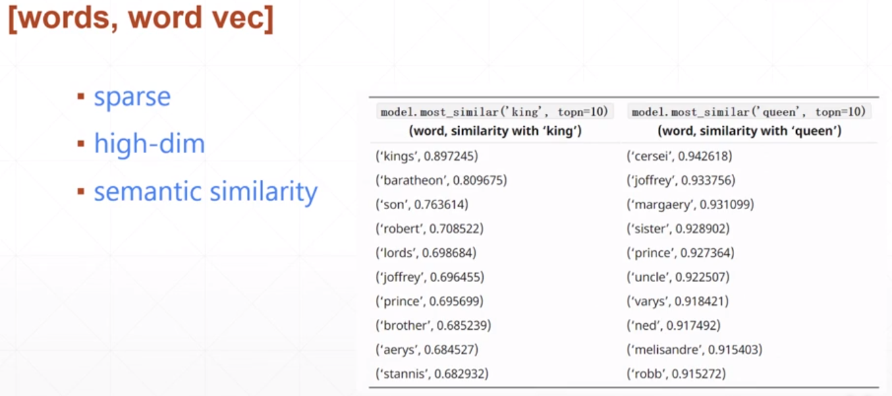
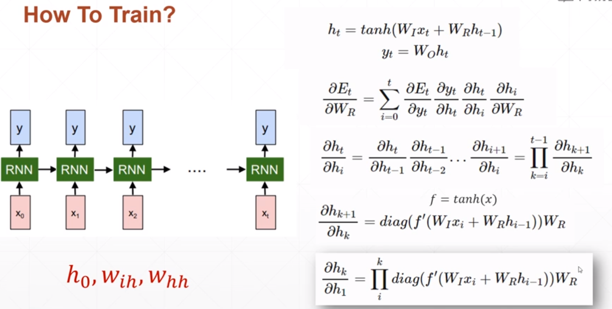
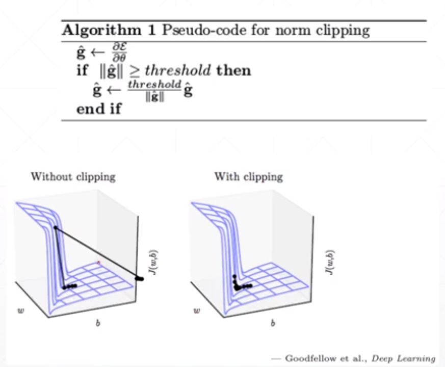

# RNN基础

## 一、Encoding

### 1.One-hot

- 维度高，占用空间

### 2.语义相关性 semantic similarity

- 计算方式

  
- 通常使用的编码方式

  - word2vec
  - GloVe

## 二、RNN网络

### 1、网络结构

- 可以自定义h~t~的更新策略

  

- h~t~的更新函数

  

### 2、训练

### 3、梯度爆炸和梯度弥散

由于RNN的梯度中包含W~R~的幂，多层RNN网络容易出现梯度爆炸或梯度弥散的问题。

#### Gradient Clipping 缓解梯度爆炸

通过限制梯度的极端值大小来缓解梯度爆炸的问题。

####