# RNN基础

## 一、Encoding

### 1.One-hot

- 维度高，占用空间

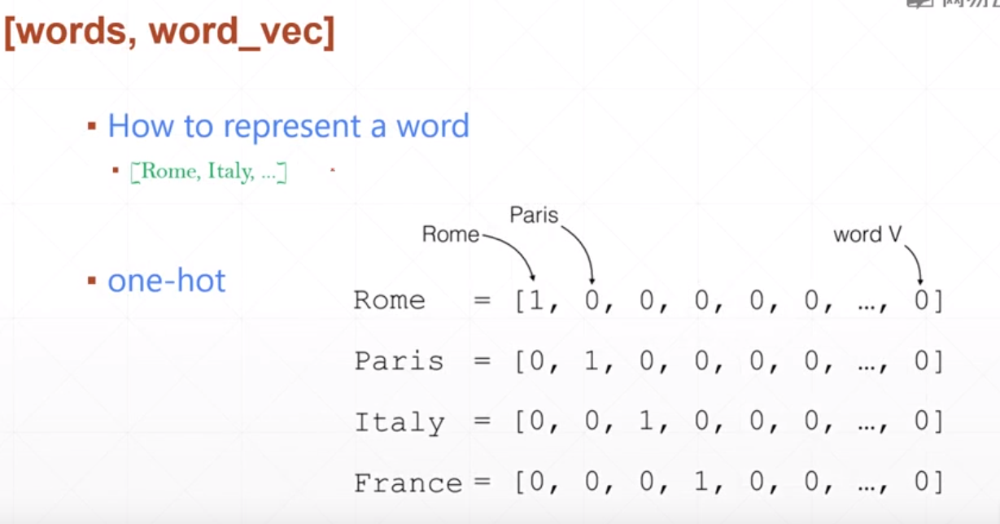

### 2.语义相关性 semantic similarity

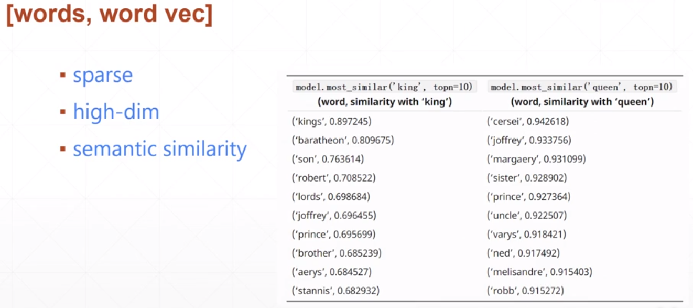

- 计算方式

  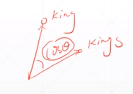
- 通常使用的编码方式

  - word2vec
  - GloVe

## 二、RNN网络

### 1、网络结构

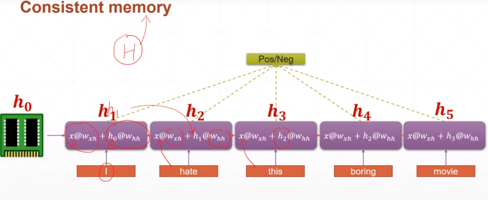

- 可以自定义$h_{t}$的更新策略

  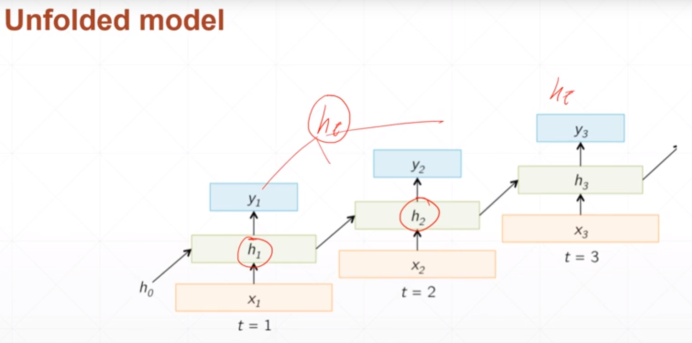

- $h_{t}$的更新函数

  

### 2、训练

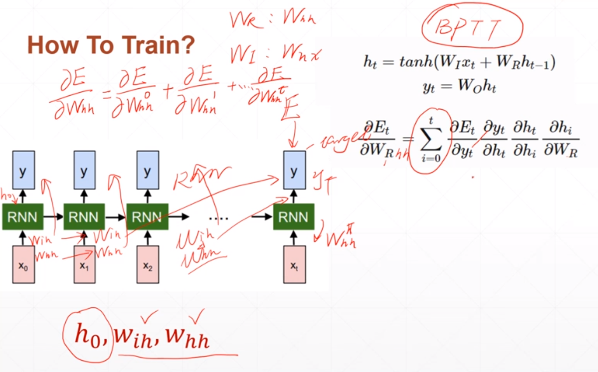

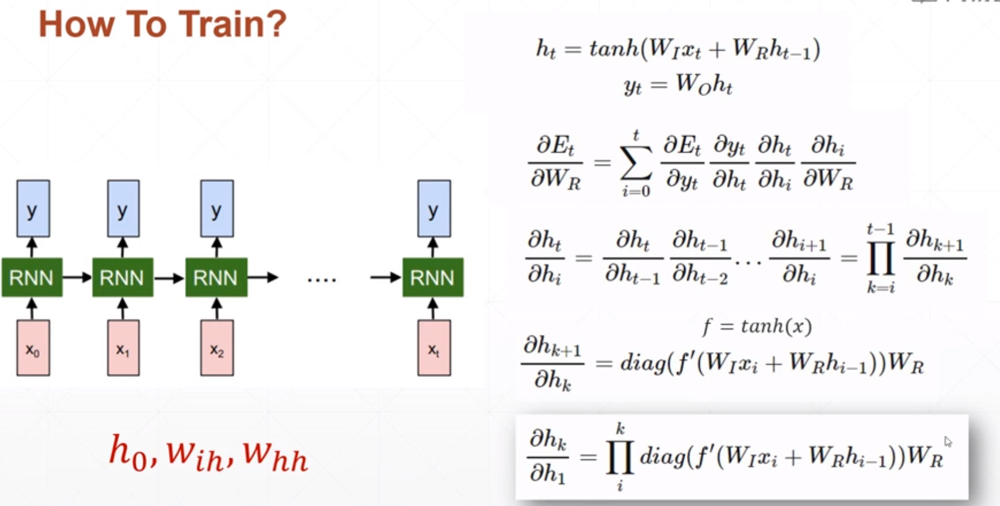

### 3、梯度爆炸和梯度弥散

由于RNN的梯度中包含$W_{R}$的幂，多层RNN网络容易出现梯度爆炸或梯度弥散的问题。

#### Gradient Clipping 缓解梯度爆炸

通过限制梯度的极端值大小来缓解梯度爆炸的问题。

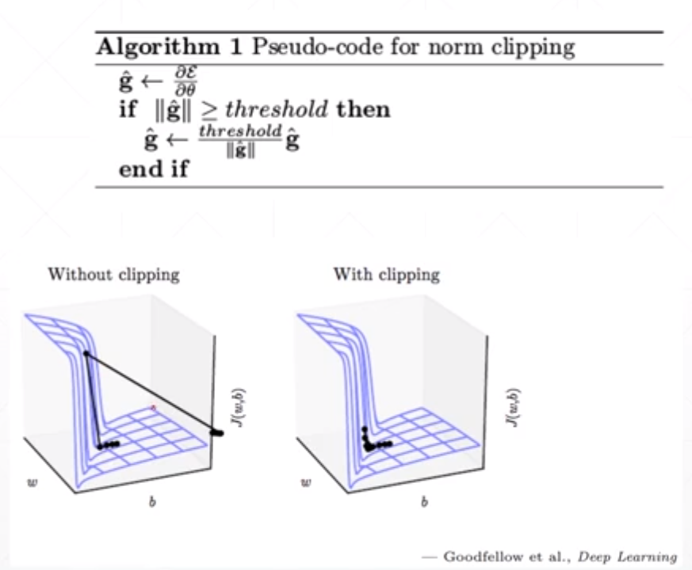

#### LSTM解决梯度弥散

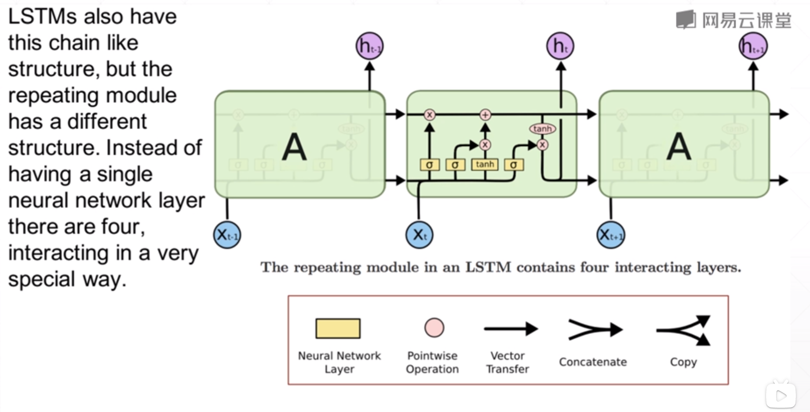

- **Forget gate**

  **对C~t-1~进行处理，保留部分记忆**

  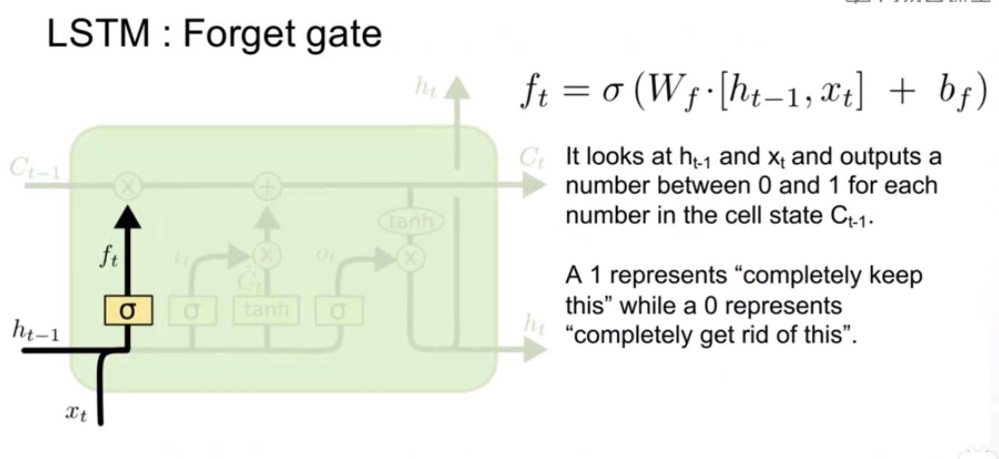

- **Input gate**

  - **对输入数据进行处理，保留部分数据**

  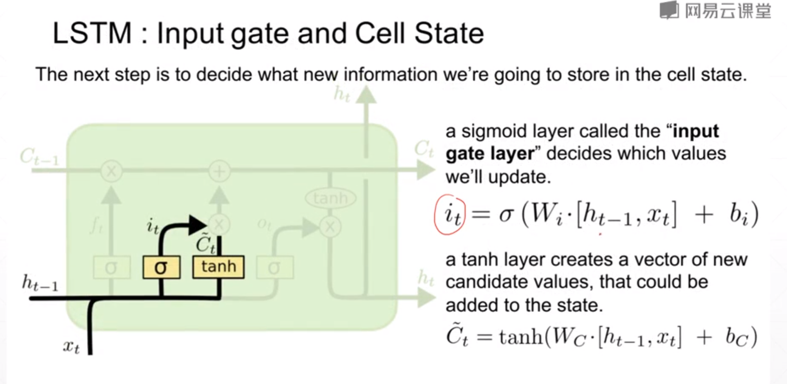

  - **将处理后的$C_{t-1}$与处理后的输入相加，生成$C_{t}$**

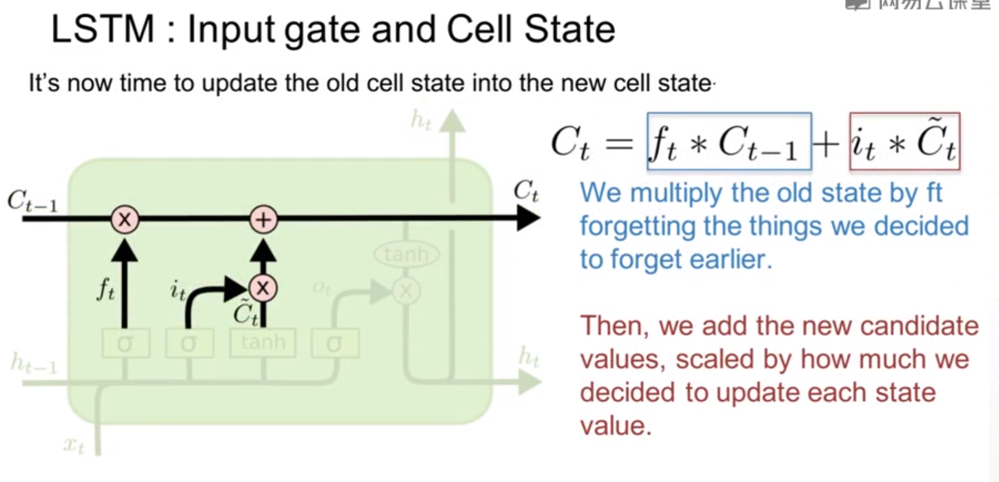

- **Output gate**

  **对输出进行处理，保留部分数据，输出$h_{t}$**

  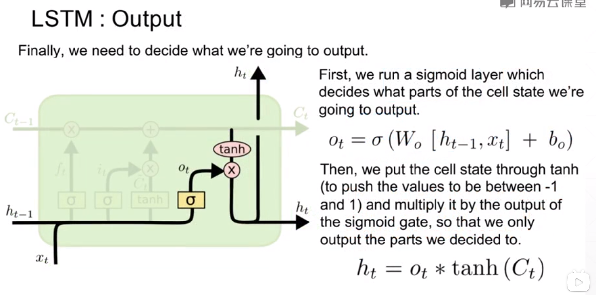

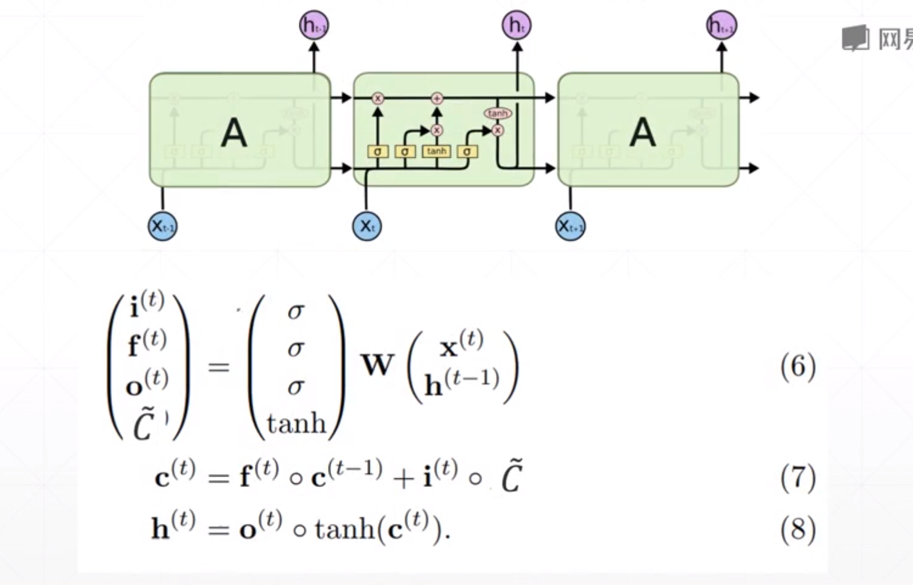

- **三个门组合逻辑**

  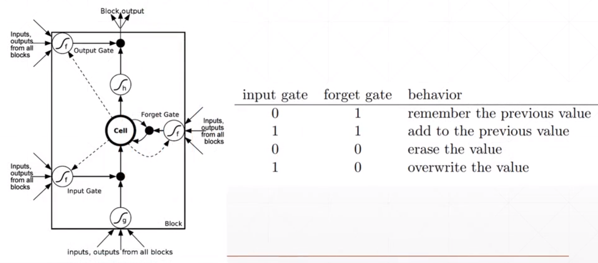

- **LSTM如何解决梯度弥散**

  **避免了$W_{R}^{k}$出现**

  

  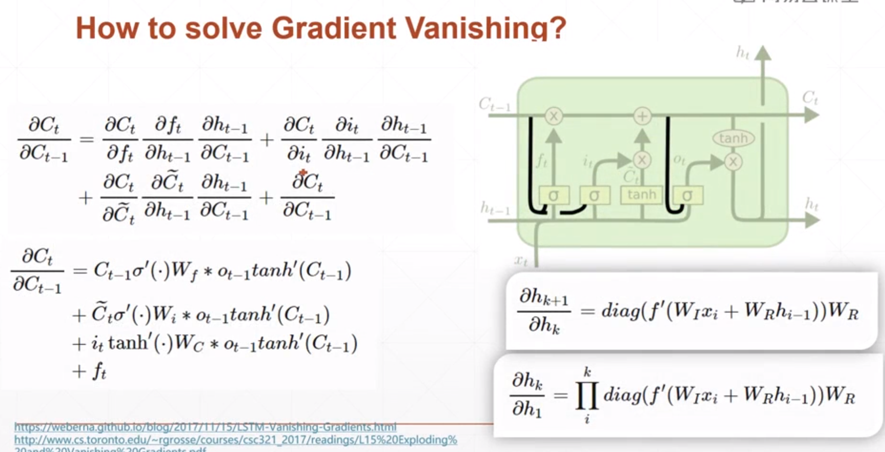

